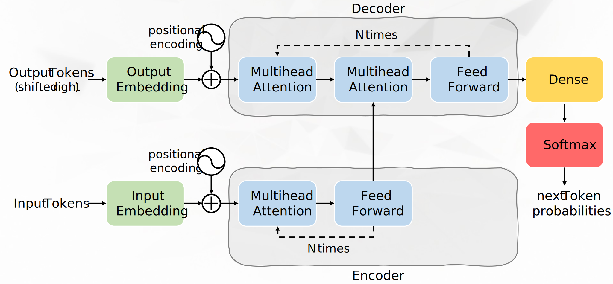

# Transformer in C++/CUDA

This repository contains the source code for the 'Transformer Project',
implemented in the course 'HPC Software Project' at Friedrich-Alexander-Universität
Erlangen-Nürnberg (FAU). The repository implements a transformer model (without
tokenizer) using C++ and CUDA, and includes various benchmarking options and
scripts to facilitate the setup and execution of benchmarks at the NHR@FAU
cluster.

This repository was tested and benchmarked using the Alex compute cluster at
NHR@FAU, with all tests and benchmarks run on nodes equipped with the
`NVIDIA A100 SXM4 – 40 GB`. The results of the benchmarks can be found in
[`results.pdf`](assets/results.pdf).

## Prerequisites
The following modules are required to run the code on the Alex cluster at
NHR@FAU:
- `cuda/11.5.0`
- `cudnn/8.2.4.15-11.4`
- `nvhpc`
- `python/pytorch-1.10py3.9`
  
The following modules are required to run the code on the TinyGPU cluster at
NHR@FAU:
- `cuda/11.6.1`
- `nvhpc`
- `python/pytorch-1.13py3.10`
  
## Getting Started
1. Clone this repository.
2. Log into the Alex or the TinyGPU cluster at NHR@FAU.
3. Request a node, e.g., via the allocation script: `. alloc.sh`
4. Prepare the environment, e.g., using: `. prepare_environment.sh`
5. You can now run unit tests using `make test` or create scaling runs of the
    transformer model using `make transformer_scaling`.

**NOTE**: The Makefile targets typically generate the required data. However, 
the first time the file `98_mnist.py` is executed, an internet connection is
required. To set up the connection, execute `. prepare_environment.sh proxy`
in the current shell.

## Features
- **Data Types**: Only `float` and `double` are supported. The unit tests are
    primarily designed for `float`. The `__half` data type is not supported.
- **Makefile Options**: The Makefile includes various targets such as `test`,
    `transformer`, `transformer_overview`, `transformer_scaling`, `mnist`,
    `mnist_extended`, and `plot`. This is a non-comprehensive list. For detailed
    information on all the different targets, please refer to the Makefile.

## Directory Structure
- `assets`: contains the benchmark results and the transformer image
- `data`: (generated programmatically) contains the data files used for testing
    and benchmarking
- `data_generation_scripts`: contains the scripts for generating the test data
    using python
- `log`: (generated programmatically) contains the log files generated during
    benchmarks
- `main`: contains example programs that demonstrate how to use the transformer
    library and code which compares various kernel implementations
- `shell_scripts`: contains helper scripts used in the Makefile
- `src`: contains the library code that provides the core functionality and
    components for the transformer
- `test`: contains unit tests

## References
This project was developed using the following resources:
- Vaswani, A. et al. (2017): Attention is All You Need, [arXiv:1706.03762](https://arxiv.org/abs/1706.03762)
- AmritanshuV (2024): Numpy-Transformer, [GitHub](https://github.com/AmritanshuV/Numpy-Transformer)
- [PyTorch](https://pytorch.org/) documentation
- various blog posts and articles
- lecture materials from different courses at FAU

## Acknowledgment
The author gratefully acknowledges the scientific support and HPC resources
provided by the Erlangen National High Performance Computing Center (NHR@FAU) of
the Friedrich-Alexander-Universität Erlangen-Nürnberg (FAU). The hardware is
funded by the German Research Foundation (DFG).
